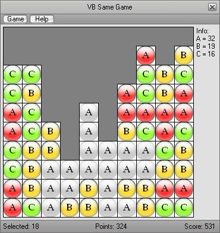

<div align="center">

## VB Same Game


</div>

### Description

This is way old, I might remake it sometime, if I have the time.

Currently I'm programming games in Visual C# with XNA, and building applications in VB.Net.

This is my version of the old 'Windows Same Game'.

The object of the game is to get the most points and clear the game area. The game area is a 10x10 grid, there are 100 Squares all with a Letter printed onto them and a coloured background. To get points the user must click twice on a group of two or more of the same letter/colour to make them disappear. If you clear the whole area you get an extra 500 points. The number of points you can get for a group is proportional to the number of squares in the group. The number of points is the number of Squares to the power of 2. It is better to try and build up a big group as you will get more points than you would if you got lots of little groups. I also added a feature which lets the user change how many letters there are, they range from 2 to 6.

Although I selected 'Advanced' I believe that it is an opinion rather than a fact, therefore I would welcome any comments on why this is or is not Advanced.

Thank you for reading, I hope you enjoy the game and please vote.

Liam.

If anyone wants to know how I made this, I will be willing to explain, email me foggy.x@hotmail.co.uk.
 
### More Info
 


<span>             |<span>
---                |---
**Submitted On**   |2007-07-15 19:27:28
**By**             |[Liam Goodacre](https://github.com/Planet-Source-Code/PSCIndex/blob/master/ByAuthor/liam-goodacre.md)
**Level**          |Advanced
**User Rating**    |5.0 (10 globes from 2 users)
**Compatibility**  |VB 5\.0, VB 6\.0
**Category**       |[Games](https://github.com/Planet-Source-Code/PSCIndex/blob/master/ByCategory/games__1-38.md)
**World**          |[Visual Basic](https://github.com/Planet-Source-Code/PSCIndex/blob/master/ByWorld/visual-basic.md)
**Archive File**   |[VB\_Same\_Ga2075587152007\.zip](https://github.com/Planet-Source-Code/liam-goodacre-vb-same-game__1-68964/archive/master.zip)

### API Declarations

```
Declare Function ExtFloodFill Lib "GDI32" (ByVal hDC As Long, ByVal X As Long, ByVal Y As Long, ByVal colorCode As Long, ByVal fillType As Long) As Long
```


